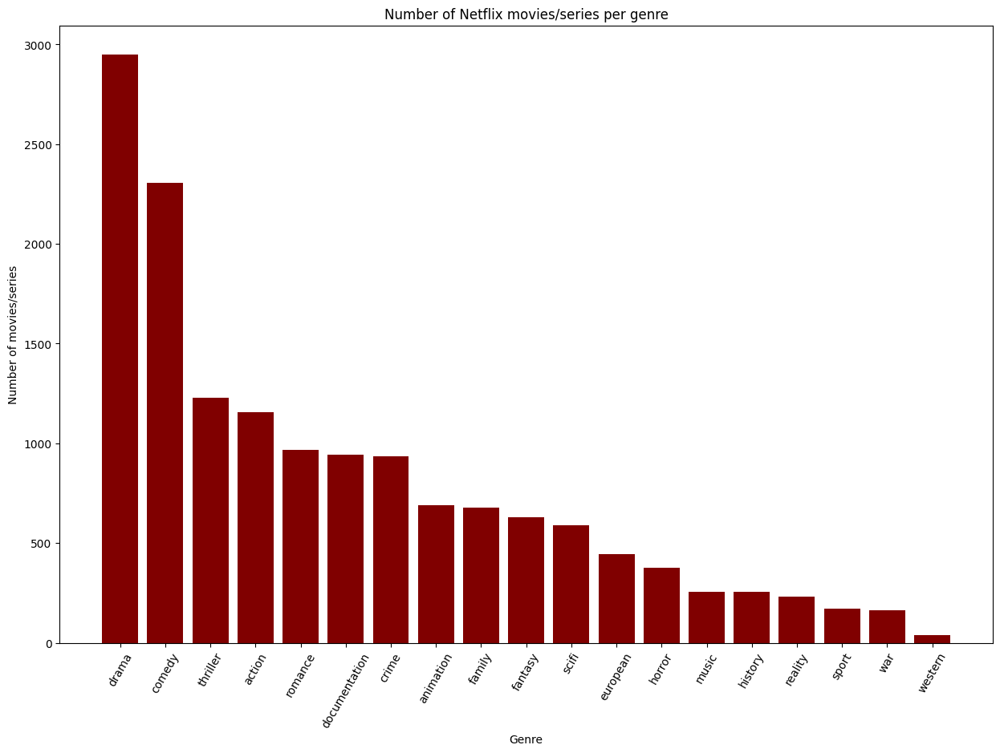
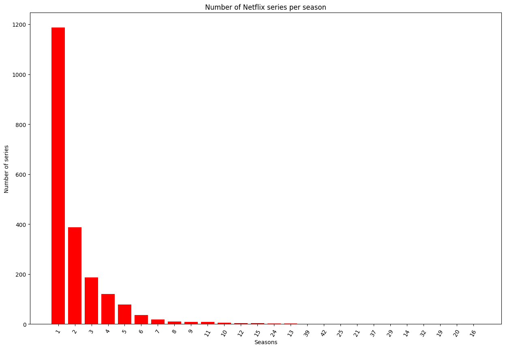
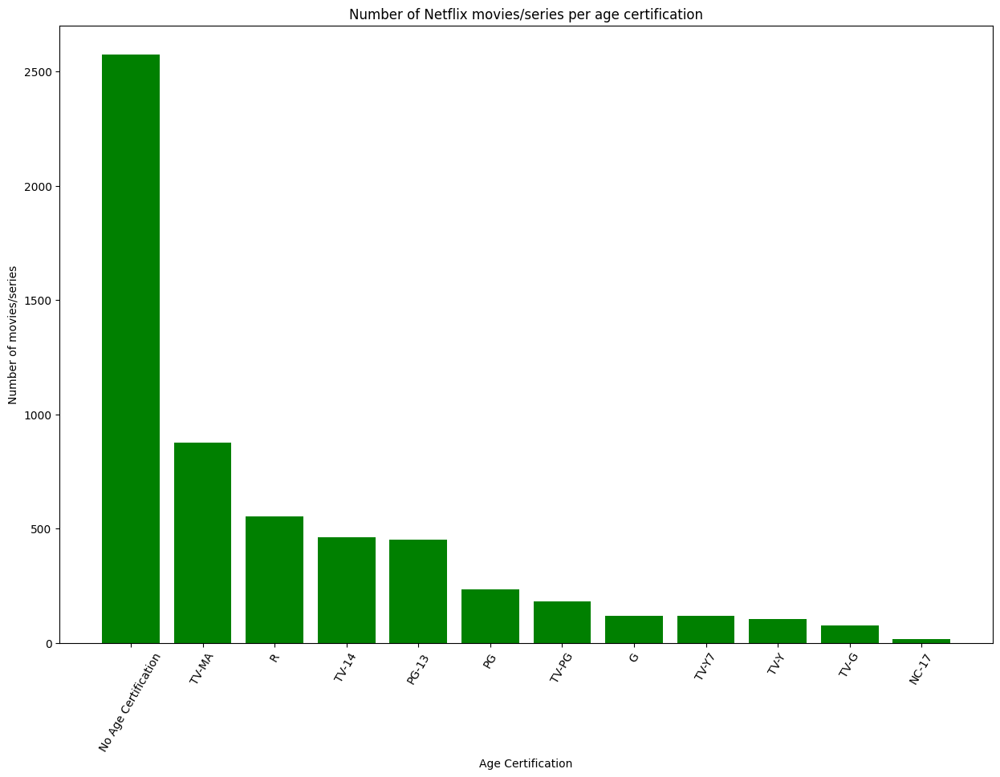
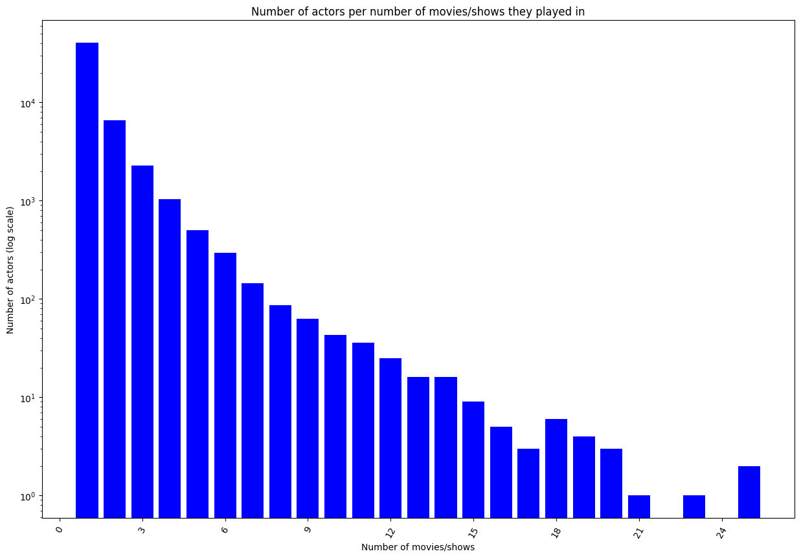

# Project of Data Visualization (COM-480)

| Student's name | SCIPER |
| -------------- | ------ |
| Patrick Louis Aldover | 385753 |
| | |
| | |

[Milestone 1](#milestone-1) • [Milestone 2](#milestone-2) • [Milestone 3](#milestone-3)

## Milestone 1 (29th March, 5pm)

**10% of the final grade**

### Dataset

The main dataset we will be using to conduct our data analysis will be the [Netflix TV Shows and Movies dataset](https://www.kaggle.com/datasets/victorsoeiro/netflix-tv-shows-and-movies?select=credits.csv). This data gathered by Victor Soeiro contains information about Netflix movies and shows and their actors. This dataset was acquired in July 2022 in the US.

The dataset consists of two files. The first file, `titles.csv`, consists of 15 columns:
1. **ID**: the movie/show ID on JustWatch
2. **Title**: the title of the movie/show
3. **Type**: movie/show
4. **Description**: a short description of the movie/show
5. **Release Year**: the release year of the movie/show
6. **Age Certification**: the age certification of the movie/show (if specified)
7. **Runtime**: The duration of the movie or one episode (show)
8. **Genres**: a list of genres
9. **Production Countries**: a list of countries that produced the movie/show
10. **Seasons**: number of seasons (show)
11. **IMDB ID**: the title ID on IMDB
12. **IMDB Score**: the score on IMDB
13. **IMDB Votes**: the votes on IMDB
14. **TMDB Popularity**: the popularity on TMDB
15. **TMDB Score**: the score on TMDB

The second file, `credits.csv`, consists of 5 columns:
1. **Person ID**: the person ID on JustWatch
2. **ID**: the movie/show ID on JustWatch
3. **Name**: the actor’s/director’s name
4. **Character Name**: the character’s name
5. **Role**: actor/director 

The actors in this dataset are already connected via the movie/show IDs. The only thing we noticed was that a few movies/shows were missing the IMDB/TMDB scores. In that case, we simply omitted those entries. 

Optionally, if we need more information on the actors themselves we will make use of the Kaggle datasets, such as [Top 100 Greatest Hollywood Actors of all Time](https://www.kaggle.com/datasets/iamsouravbanerjee/top-100-greatest-hollywood-actors-of-all-time), focusing on top 100 hollywood actors along with their date of birth and nominations they received.
### Problematic

On the 11th of March 2024, the famous actors Cillian Murphy and Emma Stone won the oscar for the “Best Actor” and the “Best Actress” for the movies Oppenheimer and Poor Things, respectively. While their acting performance for their movies was widely well-perceived, there are critics that argue that they were only selected as the winners over other, less known actors, due to their popularity. Reflecting on it, it would be intriguing to delve into what brought them being awarded such a distinction, and all in all, what are the keys of the success in the career of an actor. Since we often use Netflix to watch our favorite movies and shows, we decided to focus on Netflix movies and shows. 

Even someone not being passionate about the cinema has already heard about a few famous names like Brad Pitt, Meryl Streep or Johnny Depp. One can argue that their celebrity can be attributed to the quality of their performances in their respective movies and shows, but that would be a shallow analysis. This project aims to take a closer look, and to quantify the influence of various factors concerning the actors, such as the number of nominations and co-stars, on the success of a movie or show. Another track which would be quite interessant to investigate would be the bad performing movies and shows containing famous actors, to evaluate if one could charge them for some reasons (for instance Babylon by Damien Chazelle, which despite starring very famous actors happened to be a commercial disaster).

Our visualization will give a comprehensible insight on the impact of actors on the movie’s or show’s success. By viewing the visualizations of an actor’s influence on the movie or TV industry, viewers can make up their mind whether an upcoming movie or show will be perceived well or not. Our illustrations also highlight which co-actors worked especially well with actors. 

We mainly target three groups. First and foremost, movie and show enthusiasts can use our visualizations to discover (possibly new) actors that had a positive impact on the movies and shows they starred in. Conversely, these enthusiasts can take a look at our visualized pre-processed data to be aware of actors that negatively influenced previous movies and shows. Our second target group involves movie and TV critics. Similar to movie and show enthusiasts, they can utilize our visualizations to assist them to write reports and articles about an actor’s (un)favorable movie/TV history. Finally, we developed our visualization website also for the statistical aspect: Our illustration can assist researchers to determine key factors of a movie’s or show’s success.

### Exploratory Data Analysis

After pre-processing the data (by removing entries with no IMDB/TMDB scores), we end up with 5762 Netflix movies/series. Out of these, 2069 are shows and 3693 are movies. The movies consists of 19 different genres and were produced across 108 countries. The dataset consists of 51544 actors and 3457 directors.

Below are the illustrations of basic statistics regarding the data:

")

### Related work

Our project idea was mainly inspired by an article of the New York Times listing the [25 greatest actors of all time](https://www.nytimes.com/interactive/2020/movies/greatest-actors-actresses.html).   

As far as we know, we are the only group that uses this dataset. We do recognize that previous groups also created visualizations for movies. But instead on focusing on the movie [revenue](https://github.com/com-480-data-visualization/com-480-project-vizzybussy/blob/master/process_book.pdf) or the [ethnicity](https://github.com/epfl-ada/ada-2023-project-draco?tab=readme-ov-file) of the actors, we plan on visualizing the data in a different way by focusing more on the actor's success of movies or shows and their (un)successful collaboration with other actors. 

## Milestone 2 (26th April, 5pm)

**10% of the final grade**

## Milestone 3 (31st May, 5pm)

**80% of the final grade**

## Late policy

- < 24h: 80% of the grade for the milestone
- < 48h: 70% of the grade for the milestone

